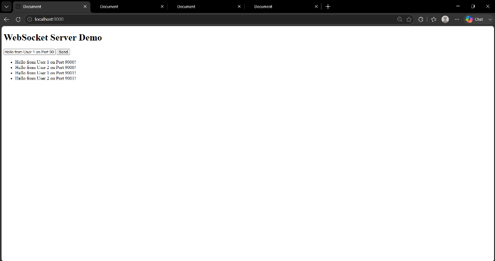
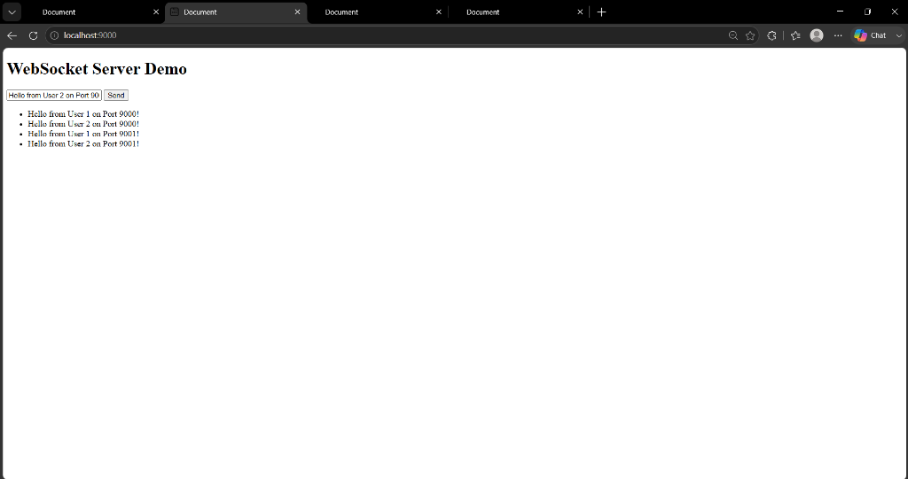
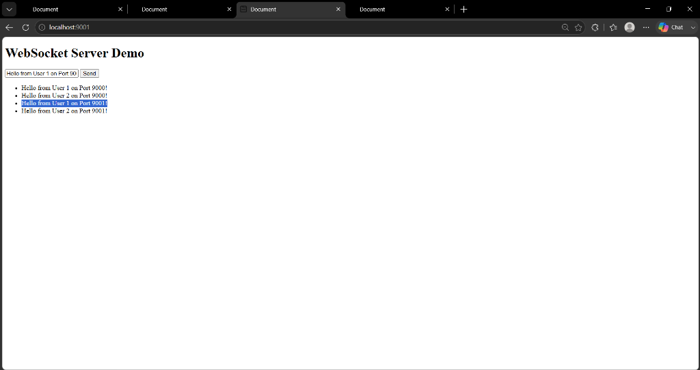
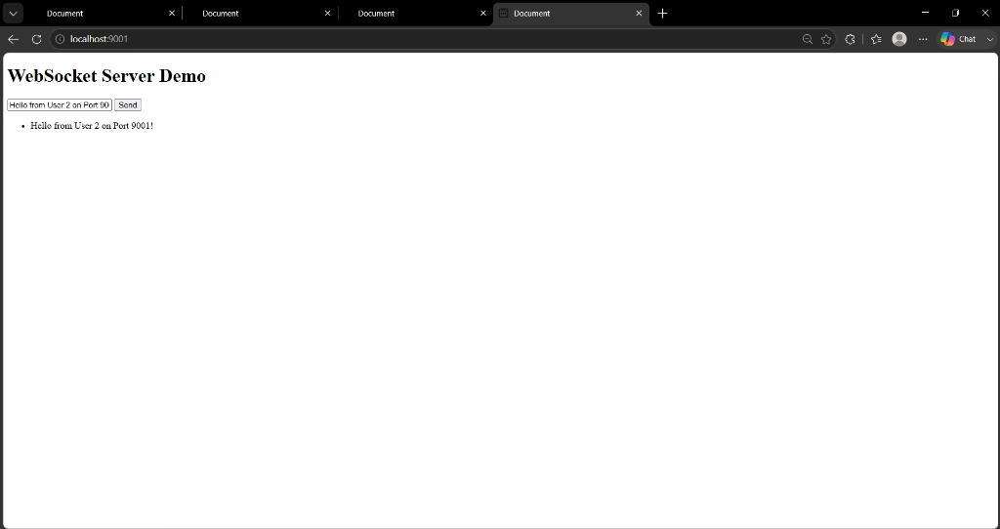

# WebSockets — Scalability, Redis Pub/Sub & Horizontal Scaling

A complete hands-on guide and demonstration of building, running, and horizontally scaling real-time **WebSocket** servers using **Node.js**, **ws**, **Docker Compose**, and **Redis Pub/Sub**.

---

## 📋 Table of Contents
1. [What are WebSockets?](#-what-are-websockets)
2. [HTTP vs WebSockets — Request-Response vs Persistent Connection](#-http-vs-websockets--request-response-vs-persistent-connection)
3. [File Descriptors & Resource Limits](#-file-descriptors--resource-limits)
4. [Why Scalability Becomes an Issue](#-why-scalability-becomes-an-issue)
5. [Vertical Scaling vs Horizontal Scaling](#-vertical-scaling-vs-horizontal-scaling)
6. [The Challenge of Horizontal Scaling & The Redis Broker Solution](#-the-challenge-of-horizontal-scaling--the-redis-broker-solution)
7. [Redis Pub/Sub Architecture](#-redis-pubsub-architecture)
8. [Codebase Walkthrough](#-codebase-walkthrough)
9. [Multi-User & Multi-Instance Verification Test](#-multi-user--multi-instance-verification-test)
10. [Interview Takeaway & Core Summary](#-interview-takeaway--core-summary)

---

## ⚡ What are WebSockets?

WebSockets provide a **persistent, long-lived, bi-directional connection** between client browsers and the server, solving the inherent latency and overhead issues of traditional polling.

### Polling vs WebSockets

```text
HTTP Polling (Request-Response Gap)
Client ─── Request ───→ Server
Client ◄── Response ─── Server (Connection Closes)
[Waiting period / Delay...]
Client ─── Request ───→ Server

WebSockets (Persistent Bi-Directional Channel)
Client ◄═════════════════════════════► Server
       Connection remains open constantly
```

- **Polling**: The client periodically sends HTTP requests asking for updates. It creates latency gaps, consumes unnecessary network header overhead, and is not true real-time communication.
- **WebSockets**: A single TCP connection is established via an HTTP Upgrade handshake and remains open indefinitely. The server can push data to the client instantly whenever an event occurs without waiting for a request.

> **Key Definition**: WebSocket is a **communication protocol**, and modern browsers expose a native **WebSocket API** (`new WebSocket('ws://...')`) to consume it.

---

## 🔄 HTTP vs WebSockets — Request-Response vs Persistent Connection

| Feature | HTTP | WebSockets |
| :--- | :--- | :--- |
| **Model** | Request-Response | Bi-directional / Event-driven |
| **Connection Lifetime** | Short-lived (per request/response cycle) | Long-lived / Persistent |
| **Data Flow** | Client initiates, Server responds | Either Client or Server can send anytime |
| **Overhead** | High (HTTP headers sent every request) | Low (Lightweight frames after handshake) |

> **Note**: While HTTP can use persistent TCP connections (`keep-alive`), its application layer remains strictly request-response. WebSockets provide a true continuous channel.

---

## 📊 File Descriptors & Resource Limits

Every active WebSocket connection consumes underlying server resources:

```text
1 Active WebSocket Connection
             ↓
    Uses Server RAM & CPU
             ↓
    Consumes 1 Operating System File Descriptor
```

An OS **File Descriptor (FD)** is an integer handle used by the kernel to track open sockets, files, and network pipes. Sockets are bounded by:
- Maximum open file descriptors (`ulimit -n`)
- Server RAM (memory allocations per socket buffer)
- CPU cycles for event loops & serialization

Therefore, a single server instance has a finite hardware limit on simultaneous active WebSocket connections.

---

## 📈 Why Scalability Becomes an Issue

Imagine a single server capable of handling **~1,000 active WebSocket connections**:

```text
  1,000 Users  ──► Server at ~100% capacity
  1,001 Users  ──► Performance degradation / dropped connections
  2,000 Users  ──► System crash without scaling
```

To serve an expanding user base, we must scale our infrastructure.

---

## 📐 Vertical Scaling vs Horizontal Scaling

### 1. Vertical Scaling ("Scale Up")
Increasing the physical or virtual hardware of the existing server machine (e.g., upgrading from 4 GB RAM to 8 GB RAM or 16 GB RAM).

```text
[ 4 GB RAM Server ] ──► Upgrade ──► [ 16 GB RAM Server ]
```

- **Cons**:
  - Requires server restart/migration, disconnecting active WebSockets.
  - Hard hardware ceilings and exponential cost curves.
  - Resource waste during off-peak hours.

### 2. Horizontal Scaling ("Scale Out")
Deploying multiple smaller server instances behind a Load Balancer.

```text
                   ┌──► WebSocket Server 1 (Port 9000) ──► Users 1 & 2
  Load Balancer ───┼──► WebSocket Server 2 (Port 9001) ──► Users 3 & 4
                   └──► WebSocket Server N
```

- **Pros**: Dynamic auto-scaling, high availability, zero-downtime rolling updates.

---

## 🌉 The Challenge of Horizontal Scaling & The Redis Broker Solution

### The Multi-Server Communication Problem

Suppose **User A** connects to **Server 1**, and **User B** connects to **Server 2**.

```text
User A (on Server 1) ───► Sends "Hello" ───► Server 1
                                                 │
                                                 X (Server 1 cannot reach User B directly!)
                                                 │
User B (on Server 2) ◄─────────────────────── Server 2
```

Since **Server 1** only maintains User A's TCP socket and has no knowledge of User B's socket on **Server 2**, direct message delivery fails.

---

### The Redis Pub/Sub Solution

By placing a central **Redis Broker** between server instances, every server acts as both a **Publisher** and a **Subscriber**.

```text
User A (on Server 1) ──► Server 1 ──► [PUBLISH] ──► Redis Broker ('ws-messages')
                                                            │
                                                     [SUBSCRIBE]
                                                            ▼
User B (on Server 2) ◄── Server 2 ◄─────────────────────────┘
```

When **User A** sends a message:
1. **Server 1** publishes the message payload to the Redis channel `ws-messages`.
2. **Redis Broker** relays the message to all subscribed server instances (**Server 1**, **Server 2**, ... **Server N**).
3. Each server receives the Redis event and broadcasts it locally to all of its connected WebSocket clients.

---

## 📡 Redis Pub/Sub Architecture

Redis Pub/Sub requires **two dedicated Redis client connections** per server process:

```text
WebSocket Server Instance
       ├── Redis Publisher Connection  (Dedicated to publishing messages)
       └── Redis Subscriber Connection (Dedicated exclusively to listening for channel events)
```

> **Why two connections?** Once a Redis client enters subscribed mode (`SUBSCRIBE channel`), it enters a dedicated state and can only issue subscription commands. Therefore, publishing requires a separate client connection.

---

## 🛠️ Codebase Walkthrough

### 1. Redis Setup (`docker-compose.yml`)
Runs a local Redis instance on port `6379`:

```yaml
services:
  redis:
    image: redis:latest
    ports:
      - "6379:6379"
```

### 2. Redis Connection Setup (`connection.js`)
Instantiates publisher and subscriber clients using `ioredis`:

```javascript
import { Redis } from 'ioredis';

export const redisPublish = new Redis({
  host: 'localhost',
  port: 6379,
});

export const redisSubscribe = new Redis({
  host: 'localhost',
  port: 6379,
});
```

### 3. Core Server Logic (`index.js`)
Configures HTTP server, WebSocket server, and Redis relay:

```javascript
import http from 'node:http';
import fs from 'node:fs/promises';
import path from 'node:path';
import { WebSocketServer } from 'ws';
import { redisPublish, redisSubscribe } from './connection.js';

const PORT = process.env.PORT ?? 9000;
const REDIS_CHANNEL = 'ws-messages';

const httpServer = http.createServer(async function (req, res) {
    const indexFile = await fs.readFile(path.resolve('./index.html'), 'utf-8');
    res.setHeader('Content-Type', 'text/html');
    return res.end(indexFile);
});

const wsServer = new WebSocketServer({ server: httpServer });

// 1. Subscribe to Redis Channel & broadcast to local clients on message
redisSubscribe.subscribe(REDIS_CHANNEL);
redisSubscribe.on('message', (channel, message) => {
    if (channel === REDIS_CHANNEL) {
        wsServer.clients.forEach((client) => {
            client.send(message.toString());
        });
    }
});

// 2. Accept client WebSocket connection & relay incoming message to Redis
wsServer.on('connection', (websocket) => {
    console.log(`Websocket Connnection....`);

    websocket.on('message', async (data) => {
        console.log(`WebSocket Message Recv.`, data.toString());
        console.log(`Relaying Message to Redis Broker...`);
        await redisPublish.publish(REDIS_CHANNEL, data.toString());
    });
});

httpServer.listen(PORT, () => {
    console.log(`Server is running on http://localhost:${PORT}`);
});
```

### 4. Client Web Interface (`index.html`)
Connects to WebSocket server and appends incoming messages dynamically:

```html
<!doctype html>
<html lang="en">
  <head>
    <meta charset="UTF-8" />
    <meta name="viewport" content="width=device-width, initial-scale=1.0" />
    <title>Document</title>
  </head>
  <body>
    <h1>WebSocket Server Demo</h1>
    <div>
      <input type="text" placeholder="Enter your message here" id="message-input" />
      <button id="message-send-button">Send</button>
      <ul id="messages-container"></ul>
    </div>
    <script>
      const messageInput = document.getElementById('message-input');
      const messageSendButton = document.getElementById('message-send-button');
      const messagesContainer = document.getElementById('messages-container');

      const { port } = window.location;
      const connection = new WebSocket(`ws://localhost:${port}`);

      connection.onopen = () => {
        connection.onmessage = ({ data: rawData }) => {
          const parsedData = JSON.parse(rawData);
          const text = parsedData.message;

          const li = document.createElement('li');
          li.innerText = text;
          messagesContainer.appendChild(li);
        };

        messageSendButton.addEventListener('click', (ev) => {
          const value = messageInput.value;
          connection.send(JSON.stringify({ message: value }));
        });
      };
    </script>
  </body>
</html>
```

---

## 🧪 Multi-User & Multi-Instance Verification Test

To test true cross-server real-time message broadcasting:

1. **Start Redis Container**:
   ```bash
   docker compose up -d
   ```
2. **Start Server Instance 1 (Port 9000)**:
   ```bash
   PORT=9000 node index.js
   ```
3. **Start Server Instance 2 (Port 9001)**:
   ```bash
   PORT=9001 node index.js
   ```

### Verification Setup:
- **Tab 1 (`http://localhost:9000`)**: User 1 on Server Port 9000
- **Tab 2 (`http://localhost:9000`)**: User 2 on Server Port 9000
- **Tab 3 (`http://localhost:9001`)**: User 1 on Server Port 9001
- **Tab 4 (`http://localhost:9001`)**: User 2 on Server Port 9001

### Test Results Across Browser Windows:

When messages were dispatched from each user across different ports:
1. `Hello from User 1 on Port 9000!`
2. `Hello from User 2 on Port 9000!`
3. `Hello from User 1 on Port 9001!`
4. `Hello from User 2 on Port 9001!`

### Test Results & Browser Screenshots

#### 1. Tab 1: User 1 on Port 9000 (`http://localhost:9000`)


#### 2. Tab 2: User 2 on Port 9000 (`http://localhost:9000`)


#### 3. Tab 3: User 1 on Port 9001 (`http://localhost:9001`)


#### 4. Tab 4: User 2 on Port 9001 (`http://localhost:9001`)


**Result**: Every user on every server instance received 100% of all messages in real time via the central Redis broker.

---

## 🎯 Interview Takeaway & Core Summary

> **Persistent Connections ──► High File Descriptor/RAM Usage ──► Single Server Limit ──► Horizontal Scaling ──► Isolated Servers ──► Redis Pub/Sub Broker ──► Global Bi-Directional Message Relay**
